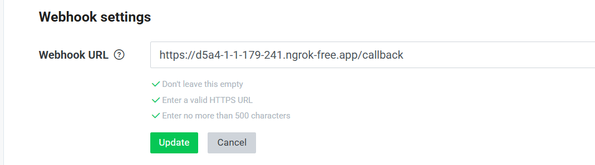
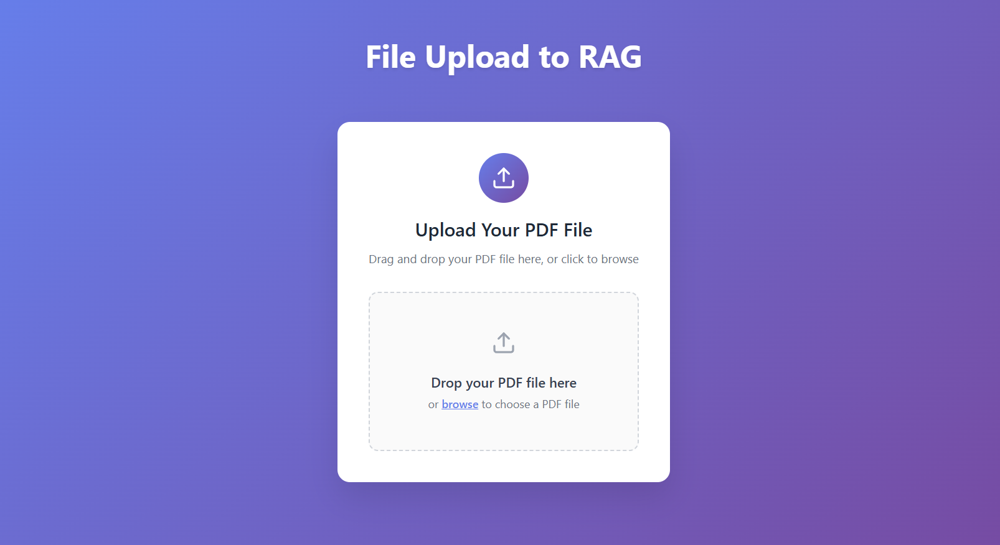

### Install Virtual Environment

คัดลอกคำสั่งด้านล่าง เพื่อลงและใช้ venv (virtual environment)
```bash
python -m venv .venv
.venv\Scripts\activate
```

### Install dependencies

คัดลอกคำสั่งด้านล่างแล้วรันใน terminal
```bash
pip install -r requirements.txt
```

### Setup .env file

นำไฟล์ .env ไว้ที่ root ของโปรเจค

```jsx title="Credentials จากไลน์"
ACCESS_TOKEN=

CHANNEL_SECRET=
```

```jsx title="Path of google credential json file"
SERVICE_ACCOUNT_FILE=
```

```jsx title="Connection string of MongoDB"
MONGODB_CONN_STRING=
```

```jsx title="API key จาก Mistral"
MISTRAL_KEY=
```

```jsx title="API key จาก Cohere"
COHERE_KEY=
```

จากนั้นนำมารวมกันในไฟล์เดียว -> .env
```jsx title=".env"
ACCESS_TOKEN=

CHANNEL_SECRET=

OPENAI_BASE_URL=

OPENAI_API_KEY=

SERVICE_ACCOUNT_FILE=

MISTRAL_KEY=

COHERE_KEY=

MONGODB_CONN_STRING=
```

### Run project
คัดลอกคำสั่งด้านล่าง รันที่ port 8000

```bash
uvicorn main:app --port 8000
```

### Deploy

เปิด terminal แล้วรันคำสั่งด้านล่าง

```bash
$ ngrok http 8000
```

ก๊อปปี้ URL ตามที่วงไว้ด้านล่าง


### Connect with Line Webhook

ไปที่ Provider ที่สร้างไว้ใน [Line Developers](https://developers.line.biz/console/)
ไปที่แถบ Massaging API เลื่อนลงมาจะเจอ Webhook URL  
นำ URL ที่ก๊อปปี้ไว้จากข้อที่แล้วมาวางแล้วเติม /callback ต่อท้าย แล้วกดปุ่ม update 

กด verify ถ้าขึ้นว่า Success แปลว่าใช้งาน Webhook ได้แล้ว

### Run Front to Upload File

เปิด terminal เพิ่มเพื่อ run
```bash
cd front
npm install
npm run dev
```

ถ้าต้องการให้ LLM ตอบคำถามในเรื่องเฉพาะเจาะจงได้ดีขึ้นให้อัพโหลดไฟล์ผ่านหน้านี้


### Run Scheduler (for calendar notification)

เปิดอีก terminal เพิ่มเพื่อ run
```bash
python -m service.scheduler
```